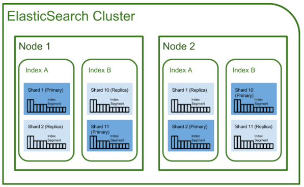

# [ElasticSearch] 
# 1. Elastic Search 란 ?
**ElasticSearch는 Apache Lucene 기반의 오픈소스 분산 검색 엔진입니다.**

엘라스틱서치에 대해서 검색하니 거의 99% 의 웹 문서에서는 이 문장으로 시작합니다. 마치 A라는 단어를 검색했는데 B 라고 설명해주고, B 라는 단어를 검색하니 A 라고 설명해주는 기분입니다. 가볍게 루씬이 무엇인지 알아봅시다. 

> Note. Logstash와 Kibana에 대해서는 아직 다루지 않습니다.

과거에, "검색" 이라는 연산을 수행하기 위해서는 SQL 데이터베이스를 사용했습니다. 우리가 웹 게시판을 하나 만든다고 할 때, 각 게시글 내에 있는 제목과 내용을 검색하기 위해 SQL 내에 `Like`와 같은 연산자를 활용했었던 것 처럼 말이죠. 어느정도 수준까지는 상관 없었지만, 이러한 방식에는 확장성, 유연성, 그리고 언어 분석의 결여가 있었습니다. 만약 데이터가 1억건이라면, 혹은 그 이상 100배의 데이터가 들어있다면, "아파치" 라는 단어를 포함한 게시글을 찾기 위해서 데이터를 **모두 살펴봐야 합니다.** 이러한 문제를 해결하기 위해 나타난 것이 Apache Lucene 입니다. 이러한 녀석들을 전문 검색(Full-text Search) 엔진이라 합니다.

그렇다면 우리가 기존에 사용하던 RDB 가 데이터의 저장에 특화되었듯이, 이 Lucene 혹은 ElasticSearch가 검색에 특화되었다는 뜻인데요. 생각을 해보면, 우리가 구글에 무언가를 검색했을 때 수 억건을 가뿐히 뛰어넘는 웹문서에서 어떻게 내가 찾고자 하는 내용과 관련있는 녀석들만 쏙쏙 뽑아서 던져줄까요? "배" 라는 단어를 검색했을 때에는 **과일**을 뜻하는 녀석과 **Ship**을 뜻하는 녀석이 둘 다 있지만, 바다 라는 단어를 넣어주면 Ship과 관련된 단어만, **그것도 아주 빠르게** 보여주게 됩니다.

그렇다면 ElasticSearch는 어떻게 동작하길래 이러한 기능을 수행할 수 있을까요? 이는 역색인(Inverted Index)에서 기반합니다.

# 2. Inverted Index
역색인은 우리가 책의 맨 뒷페이지에서 흔하게 찾아볼 수 있습니다. 특정 키워드에 대해서, 몇 페이지에 있다 라고 알려주는 녀석이 바로 역색인인데요. 하나 예시를 들어보겠습니다.

다음과 같이 세 개의 문장 데이터가 있다고 가정해봅니다.

* Elasticsearch Server 1.0
* Mastering Elasticsearch
* Apache Solr 4 Cookbook

이 세 개의 문장을 일반적인 RDB에 저장한다면 어떻게 될까요? 각각 Id 값을 준다면, 1번에 첫 번째 문장이, 2번에 두 번째 문장이 저장되는 식이겠죠. 하지만 역색인은 다음과 같이 저장합니다.

|키워드|수|다큐먼트|
|:--:|:--:|:--:|
|1.0|1|1|
|4|1|3|
|Apache|1|3|
|Cookbook|1|3|
|Elasticsearch|2|1, 2|
|Mastering|1|2|
|Server|1|1|
|Solr|1|3|

> Note. Document는 RDB 의 row와 비슷한 개념으로 이해할 수 있습니다.

위와 같이, 1.0 이라는 단어는 1번 문서에서 1번 등장했으며, Elasticsearch는 1, 2번 문서에서 2번 등장했다는 것을 저장합니다.실제로 저장되는 내용은 좀 더 복잡합니다.(키워드 벡터, doc 값 ...)

아무튼, 그렇다면 만약 사용자가 Elasticsearch에 대해서 검색했다면, 1번 문서와 2번 문서를 돌려주는 방식으로 검색엔진은 동작합니다.

# 3. Logical Architecture Terminology

검색엔진이 어떻게 동작하는지 알았다면, 개략적인 용어에 대해서 파악해봅시다. 

  
[출처](https://d2.naver.com/helloworld/273788)

이 표는 두고두고 외워두도록 합시다. 

# 4. Physical Architecture Terminology

앞서 RDB는 확장성과 유연성이 상대적으로 부족하다고 말씀드렸었습니다. 이는 "Elasticsearch는 그렇지 않다" 라는 뜻이기도 한데요. 이를 뒷받침하는 개념이 Cluster와 Node, 그리고 Shard 와 Replica 입니다.

다음의 사진을 보면서 읽으면 좀 더 이해하기가 수월할것 같습니다.

## 4-1. Cluster & Node

클러스터는 Elasticsearch은 Node들로 구성되어 있는 집합입니다. 간단하게는 여러 대의 컴퓨터를 묶은 개념이라고 봐도 무방합니다. 그렇다면 Node는 역시 하나의 컴퓨터라고 생각해볼 수 있겠습니다. Node 의 종류는 여러가지가 있지만 대표적으로 Master Node과 Data Node가 있습니다. Master Node는 클러스터를 제어하는 역할을 하며, Data Node는 실제 데이터를 저장하는 역할을 맡습니다. 다른 Node에 대해서는 [여기](https://www.elastic.co/guide/en/elasticsearch/reference/current/modules-node.html) 를 참고하세요.

## 4-2 Shard & Replica

Shard는 RDB 에서 말하는 샤딩과 같은 개념입니다. 1억 건의 데이터가 있고, 샤드의 개수가 2개라면 각각의 샤드에는 5천만 건의 데이터가 저장되겠죠. RDB에선 *Horizontal Partitioning* 이라고 불리기도 합니다.  
Replica는 이름 그대로 샤드에 대한 복사본이고, 0 개 이상 존재할 수 있습니다. 복사의 대상이 되는 샤드를 주 샤드, 복사한 샤드를 레플리카 샤드라고 합니다. 복사를 하는 이유는 노드에 장애가 생겼을 때를 대비한 것이니, 레플리카 샤드는 주 샤드와 다른 곳에 위치하는 것을 권장합니다.

어떻게 생겨먹었는지는 대충 알았으니, 다음 시간엔 Elasticsearch를 설치하고, 간단한 CRUD 까지 진행해보도록 하겠습니다. 틀린 부분이 있으면 지적바랍니다. 감사합니다.

